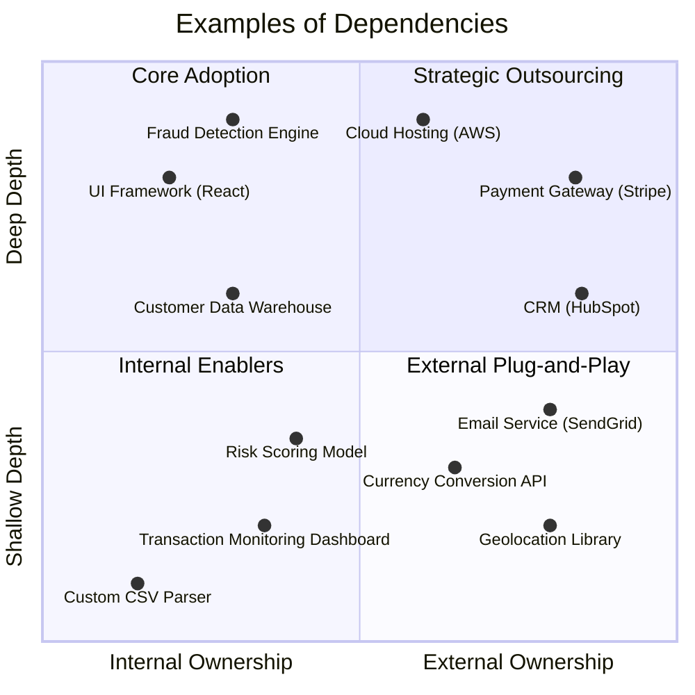

## Overview

_“What do we build, buy, or integrate?”_

No software system exists in isolation. Every solution relies on an ecosystem of tools, libraries, platforms, and services, each playing a role in its capability and success. **Dependency** focuses on strategically managing this ecosystem—deciding what to build, what to buy, and how to seamlessly connect all the pieces.

This foundational aspect is about **understanding the core identity of your solution**: _what makes it unique and mission-critical?_ This identity informs decisions about ownership versus reliance. 

Each decision requires deep consideration—relying on third-party solutions can accelerate development and offload complexity but introduces risks, such as vendor lock-in, dependency vulnerabilities, or misalignment with future needs. 

Ultimately, **Dependency** challenges teams to think holistically about the ecosystem their software inhabits.

## What is Dependency?

**Dependency** refers to any component, system, or service that a solution relies on to function. The challenge is defining what we mean by the "solution." The end product seen by stakeholders and users is the result of a symphony of interconnected components stitched together into a cohesive system. In this context, a dependency is something that is less core to the solution's identity, and is more a composable feature that enables the solution.

{}
A **dependency** is anything that the solution relies upon but is not part of its core identity or directly owned.
{}

Understanding dependencies requires framing them within a specific context. For example, in the context of an e-commerce platform, a custom-built recommendation engine may be part of its core identity, while a third-party payment gateway like Stripe would be considered a dependency. 

By agreeing on the “core identity” of a solution, you can determine what lies outside it and consider those as dependencies.

### Dependency Classification

When classifying something as a _dependency_ it can be helpful to evaluate it along two key axes: **Ownership** and **Depth**.

**Ownership** refers to who controls the dependency and how much influence or authority your team or organization has over it. The axis ranges from:

- **Internal Ownership:** Dependencies that are owned, built, or directly managed by your team or organization. These offer more flexibility and control over changes but require ongoing maintenance and expertise.
- **External Ownership:** Dependencies provided by third parties, such as SaaS platforms, open-source libraries, or APIs. These are convenient and reduce the operational burden but limit customization and are subject to external constraints (e.g., vendor priorities, licensing changes).

{}
**Internal dependencies** align closely with your team’s goals but require resource investment to build and maintain, whereas **external dependencies** offer speed and efficiency but can introduce risks like vendor lock-in or opaque updates.
{}

**Depth** refers to how deeply ingrained the dependency is within your system—essentially, how coupled it is to your workflows, architecture, or business logic. This ranges from:

- **Shallow Depth:** Dependencies that are lightly coupled and relatively easy to replace or remove. These might include standalone tools, integrations, or utility libraries.
- **Deep Depth:** Dependencies that are tightly integrated into your core workflows, architecture, or decision-making processes. Replacing these can be challenging, costly, and risky.
Key Considerations for Depth:

{}
**Shallow dependencies** are easier to manage and replace but may lack the robustness or specificity required for deeper integration, whereas **deep dependencies** provide essential functionality but require careful planning and risk management to avoid technical debt or future bottlenecks.
{}

### Examples of Dependency

Every organization is different but the the following diagram illustrates a few possible examples:

**Core Adoption (Internal Ownership + Deep Depth)**

These dependencies are deeply tied to the organization’s strategic goals and workflows, making them integral to the solution's "core identity."

- **Fraud Detection Engine:** A proprietary system that uses machine learning to analyze transactions and detect fraudulent behavior. Built in-house to maintain competitive advantage and tightly integrated into the payment flow.
- **Custom Analytics Platform:** An in-house developed solution for all customer and transaction data. This system is critical for long-term analytics, reporting, and compliance.
- **UI Framework (React):** A front-end framework selected for building all customer-facing applications, the entire front-end ecosystem relies on it, making it difficult to replace.

**Internal Enablers (Internal Ownership + Shallow Depth)**

These are lightweight, internally built tools or utilities designed to support workflows without being deeply ingrained in the architecture.

- **Risk Scoring Model:** Interchangeable machine learning models for scoring transactions by risk level. Designed to enable rapid iteration and experimentation without tightly coupling them to the fraud detection engine.
- **Transaction Monitoring Dashboard:** A lightweight internal tool for customer support and operations teams to track payment statuses in real-time.
- **Custom CSV Parser:** A lightweight, in-house utility designed to parse and process CSV files for internal batch data imports or exports. It’s simple, easily replaceable, and tailored to the organization’s specific formats and workflows, but not deeply integrated into the core system.

**Strategic Outsourcing (External Ownership + Deep Depth)**

These dependencies provide essential functionality but are managed externally, requiring trust in third parties for critical operations.

- **Cloud Hosting (AWS):** A cloud provider hosting the entire application infrastructure, providing scalability, reliability, and availability. Deeply integrated with deployment and operational workflows.
- **Payment Gateway (Stripe):** A third-party service to handle payment processing, ensuring PCI compliance and managing global transaction flows.
- **CRM (HubSpot):** A third-party customer relationship management platform used for managing merchant relationships, customer communications, and sales pipelines. Deeply integrated into marketing, support, and operational workflows, making it critical but externally managed.

**External Plug-and-Play (External Ownership + Shallow Depth)**

These are modular, external solutions that are easy to integrate, replace, or remove.

- **Email Service (SendGrid):** A third-party service for sending payment confirmation emails to customers, reducing the need to manage email servers internally.
- **Currency Conversion API:** An external API for real-time currency exchange rates, used in international transactions.
- **Geolocation Library:** A third-party library that identifies user locations based on their IP addresses. Used for fraud detection or tailoring user experiences.

## Key Decision Points

Making dependency decisions requires a balance of technical, business, and strategic considerations. The table below offers a way to evaluate a build vs. buy (i.e, ownership versus reliance) decisions.

| **Point**           | **Consideration**                 |
|---------------------|-----------------------------------|
| **Strategic**       | Proprietary Advantage, Long-Term Alignment, Security Considerations |
| **Maturity**        | Team Expertise, Complexity |
| **Volatility**      | Dependency Evolution, Business Needs Evolution |
| **Invesment**       | Build vs. Buy, Hidden Costs |

We can unpack each of these to understand the decision points better:

**Strategic**

- **Proprietary Advantage:** Is this dependency tied to the core value proposition of your business? If so, owning it might be essential to maintain differentiation.
    - Example: A fintech company may build its fraud detection system to ensure competitive edge rather than rely on a generic third-party solution.
- **Long-Term Alignment:** Does the dependency fit with the organization’s future goals and technology roadmap? Misaligned dependencies can become costly to replace or adapt.
    - Example: An e-commerce startup choosing Shopify for speed may outgrow its limitations as it scales, requiring a costly migration to a custom-built platform.
- **Security Considerations:** Does the dependency handle sensitive data or critical workflows? If so, ensure it meets your compliance, privacy, and security requirements.

### Maturity

- **Team Expertise:** Does your team have the skills to build and maintain this dependency? Or is it better to rely on external experts?
    - Example: Adopting a managed service like MongoDB Atlas may save time for teams unfamiliar with database tuning and scaling.
- **Complexity:** Will building in-house add unnecessary complexity? Managed services often reduce operational burden but may limit flexibility.

### Volatility

- **Dependency Evolution:** Is the dependency in a rapidly changing market? Relying on third-party solutions in such cases ensures you can leverage the latest innovations.
    - Example: Leasing a data center instead of building one offers adaptability as technology evolves.
- **Business Needs Evolution:** Are your requirements stable, or are they evolving quickly? If your needs outpace the dependency’s capabilities, building custom may be better.

### Invesment

- **Build vs. Buy:** Consider the upfront and ongoing costs of building, maintaining, and scaling a solution versus licensing or leasing it.
- **Hidden Costs:** Factor in integration, data migration, vendor lock-in, and the potential cost of switching providers.

## Foundational Impacts 

TBD

## Tracking Dependencies

When developing software, engineers often search for dependencies of all kinds to avoid reinventing the wheel. While this can accelerate development, it may also lead to unintended consequences, such as security and licensing concerns, misalignment with strategic goals, or costly refactorings when a dependency fails to meet long-term needs.

So how do you keep track of these dependencies? Sophisticated tools for automatically detecting software dependencies are incredibly useful and should form the foundation of your process. These tools excel at identifying code modules referenced through package management systems and other easily traceable components. However, they may not capture the full picture—external services accessed via HTTP calls, bespoke integrations, or undocumented systems can remain hidden. That’s why having humans in the loop is essential to verify the information and uncover dependencies that might otherwise go unnoticed.

{}
To achieve a truly comprehensive dependency mapping, automated tooling must be complemented by a collaborative team effort to identify and document less obvious dependencies.
{}

Regardless of the tools used, the goal is the same: to identify and evaluate the components your solution relies on. For business leaders, this exercise is invaluable—it reveals how dependencies interact, highlights risks and opportunities, and pinpoints where strategic decisions may be needed.

The end result of this process could be as simple as a spreadsheet, structured like the following:

| **Dependency**             | **Ownership**       | **Depth** | **Importance** | **Description**                                                                 |
|-----------------------------|---------------------|-----------------|----------------|---------------------------------------------------------------------------------|
| Fraud Detection Engine      | Internal (Team A)   | 5               | High           | Proprietary system detecting and preventing fraud in real-time.                 |
| Risk Scoring Model          | Internal (Team B)   | 2               | Medium         | ML-based scoring system for transaction risk, easily swappable for iteration.   |
| Payment Gateway             | External (Stripe)   | 4               | High           | Processes payments, handles compliance (e.g., PCI), critical for operations.    |
| React Framework             | External (React)    | 5               | High           | Front-end framework used across all customer-facing interfaces.                 |
| Analytics Platform          | Internal (Team C)   | 4               | Medium         | In-house platform tracking transaction metrics and user behavior.               |
| Currency Conversion API     | External (3rd Party)| 2               | Low            | API providing real-time currency exchange rates for cross-border transactions.  |
| Email Notification Service  | External (SendGrid) | 1               | Low            | Sends payment confirmation emails to customers, simple and easily replaceable.  |

Dependencies can be categorized based on their characteristics:

**Ownership:** Who owns and controls the dependency?
- **Internal (Team):** Built and maintained by one or more teams within the organization.
- **External (3rd Party):** Provided by a vendor or open-source community.

**Depth (1–5):** How deeply ingrained is the dependency?
- **1–2 (Shallow):** Minimal integration, modular, and easy to replace.
- **3–4 (Moderate):** Some integration into workflows but still manageable.
- **5 (Deep):** Critical and deeply embedded into the system. Replacement is costly or disruptive.

**Importance:** The business impact of the dependency:
- **High:** Essential for core functionality.
- **Medium:** Supports key workflows but can be replaced or temporarily paused.
- **Low:** Enhances functionality but isn’t critical.

### Continuous Monitoring

Technology evolves rapidly, and even if you haven’t changed your solution, your third-party dependencies likely have. New versions are released regularly to address defects, patch security vulnerabilities, and introduce new features. Monitoring these changes should be an ongoing process, which is why tools and automations that continuously scan and produce dependency reports are invaluable.

However, don't forget the human in the loop! Regular reviews of automated reports, combined with periodic manual updates, help maintain a clear understanding of the ecosystem supporting your solution. This proactive approach ensures you stay ahead of potential surprises, such as deprecated features or newly introduced risks, and maintain the stability and reliability of your solution.

## Trade-Offs

### Build vs. Buy (CRM Example)

When deciding between building a custom CRM solution and adopting a commercial off-the-shelf (COTS) product like HubSpot, stakeholders face a classic trade-off. Both approaches have distinct advantages and risks, and the decision often hinges on factors like business goals, budget, timeline, and long-term flexibility. Hybrid solutions, which blend elements of both, offer a middle ground but come with their own set of challenges.

- **Option 1 - Build a Custom CRM Solution:** Building a CRM solution tailored to the specific needs of the organization provides unmatched customization and control. Teams can design workflows, data structures, and integrations precisely aligned with their business operations.
- **Option 2 - Adopt HubSpot as a COTS Solution:** HubSpot, as a COTS product, offers a robust, pre-built CRM solution with features designed to address a wide range of use cases. It is often favored for its simplicity and scalability.
- **Option 3 - Hybrid Approach:** A hybrid approach involves using HubSpot or another COTS CRM as a foundation while building custom extensions or workflows to address unique business needs.

| **Option**          | **Short-Term Advantage**                     | **Long-Term Advantage**                    | **Short-Term Risk**                  | **Long-Term Risk**                   |
|---------------------|---------------------------------------------|-------------------------------------------|--------------------------------------|--------------------------------------|
| **Build**           | Full control, tailored solution             | Seamless evolution with the business       | High cost and time investment        | Maintenance burden, internal reliance |
| **Buy (HubSpot)**   | Quick deployment, lower upfront cost         | Access to updates and vendor support       | Limited customization, vendor lock-in| Scaling limitations                  |
| **Hybrid**          | Faster deployment with partial customization | Balanced flexibility                       | Moderate effort and cost             | Integration and compatibility risks   |

### Software Library (Docker Base Image Example)

Modern software development often relies on containers, which are a lightweight and reliable way to run software. Containers can be compared to standardized shipping containers—they package everything needed to run an application in a predictable and portable format. Docker is a tool that simplifies the creation and management of these containers, ensuring they include all the necessary components for smooth operation.

A Docker base image serves as the starting point for these containers, providing a preconfigured environment upon which developers build their applications. While choosing a base image might seem like a minor technical detail, it can have a profound impact on a system’s performance, security, and maintainability. For example, Ubuntu is a widely trusted base image, supported by a large community, while Alpine is a minimalist image optimized for efficiency. Alternatively, niche, custom-built images offer tailored solutions but come with unique risks and challenges.

- **Option 1 - Use a Standard Image (e.g., Ubuntu):** Industry-standard images like Ubuntu offer reliability, compatibility, and extensive community support.
- **Option 2 - Use a Minimalist Image (e.g., Alpine):** Minimalist images like Alpine are smaller and faster but may introduce challenges with compatibility and debugging.
- **Option 3 - Use a Custom Niche Image:** Custom or obscure images can streamline the build process for specific use cases but often come with risks related to transparency, long-term support, and security.

| **Option**               | **Short-Term Advantage**                        | **Long-Term Advantage**                    | **Short-Term Risk**                      | **Long-Term Risk**                       |
|--------------------------|------------------------------------------------|-------------------------------------------|------------------------------------------|------------------------------------------|
| **Standard Image**       | Broad support, ease of use                     | Stable, widely understood, and secure     | Larger size, may include unnecessary dependencies | Limited optimization for specific use cases |
| **Minimalist Image**      | Smaller size, faster builds, reduced attack surface | Efficient and lightweight                 | Dependency conflicts, harder debugging   | May require frequent updates or fixes    |
| **Custom Niche Image**    | Tailored to project, optimized for specific needs | Highly streamlined for unique requirements| Lack of transparency, higher risk of issues | Abandonment, lack of long-term support    |

## Why this Matter

This Long tail.