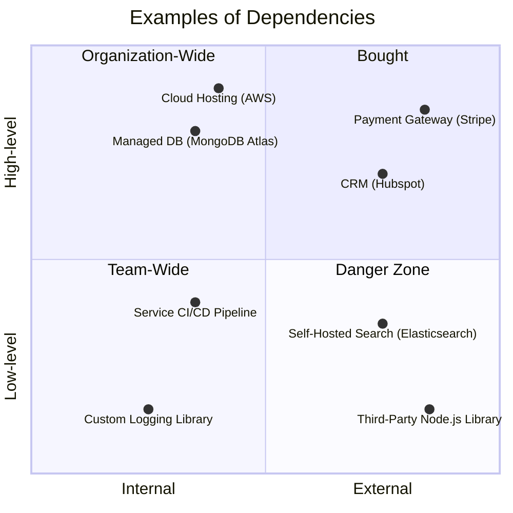

## Overview

_Harmonizing internal and external components to create cohesive, effective solutions._

No software system exists in isolation. Every solution relies on an ecosystem of tools, libraries, platforms, and services, each playing a role in its capability and success. **Dependency** focuses on strategically managing this ecosystem—deciding what to build, what to buy, and how to seamlessly connect all the pieces.

This foundational aspect is about **understanding the core identity of your solution**: what makes it unique and mission-critical? This identity informs decisions about ownership versus reliance. 

Each trade-off requires deep consideration—relying on third-party solutions can accelerate development and offload complexity but introduces risks, such as vendor lock-in, dependency vulnerabilities, or misalignment with future needs. 

Ultimately, Dependency challenges teams to think holistically about the ecosystem their software inhabits.

## What is Dependency?

**Dependency** refers to any component, system, or service that a solution relies on to function. The challenge lies in defining what we mean by the "solution." The end product seen by stakeholders and users is the result of a symphony of interconnected components stitched together into a cohesive system. In this context, a dependency is something that is less core to the solution's identity, and is more a composable feature that _enables_ the solution.

{}
A **dependency** is anything that the solution relies upon but is not part of its core identity or directly owned.
{}

Understanding dependencies requires framing them within a specific context. By agreeing on the "core identity" of a solution, you can determine what lies outside it and consider those as dependencies.

### Examples of Dependency

Classifying something as a _dependency_ requires nuance, but it can be helpful to evaluate it along two key axes: **scope** and **level**.

**Scope** refers to ownership—ranging from internal (within your team or organization) to external (outside your organization). Internal dependencies offer more direct control, as they can be modified or updated according to your needs. External dependencies, on the other hand, are owned by third parties, such as SaaS providers. Changes to these external dependencies are typically subject to the priorities of the provider, balancing the needs of all their customers.

**Level** relates to the size or complexity of the dependency. High-level dependencies encompass holistic services, platforms, or distributed workflows. Low-level dependencies, in contrast, are more granular and technical, such as tools, frameworks, or libraries. While this classification isn’t rigid, it provides a useful framework for understanding dependencies.

Every organization is different but the the following diagram illustrates a few possible examples:

This is not an exhaustive list, but it offers some insight into the considerations involved in understanding dependencies:

- **Team-Wide:** Low-level internal dependencies in this category typically include smaller, focused elements like libraries, frameworks, tools, or individual components and services. These are often straightforward to understand and manage within a single team’s scope.

- **Organization-Wide:** High-level dependencies here refer to larger, more complex workflows or systems—such as service-oriented architectures (SOA) or distributed services. While still internal to the organization, these dependencies span multiple teams and require coordination and governance to maintain control.

- **Outsourced:** High-level external dependencies encompass managed solutions, third-party products, or SaaS platforms. These are owned and operated outside the organization, making them harder to influence or control directly while offering scalability and reduced operational burden.

- **Danger Zone:** External low-level dependencies are often unavoidable but can be risky. These include third-party libraries or tools that are small in scope but can introduce vulnerabilities, maintenance challenges, or disruptions if not carefully managed. Awareness and mitigation are crucial here.

### Key Decision Points

Making dependency decisions requires a balance of technical, business, and strategic considerations. There are many factors to go into this, however there are four common points to evaluate.

| **Point**           | **Why**                     |
|---------------------|-----------------------------------|
| **Strategic**       | Proprietary Advantage, Long-Term Alignment, Security Considerations |
| **Maturity**        | Team Expertise, Simplicity vs. Complexity |
| **Volatility**      | Dependency Evolution, Business Needs Evolution |
| **Invesment**       | Build vs. Buy, Hidden Costs |

We can unpack each of these to understand the decision points better:

#### Strategic
- **Proprietary Advantage:** Is this dependency tied to the core value proposition of your business? If so, owning it might be essential to maintain differentiation.
    - Example: A fintech company may build its fraud detection system to ensure competitive edge rather than rely on a generic third-party solution.
- **Long-Term Alignment:** Does the dependency fit with the organization’s future goals and technology roadmap? Misaligned dependencies can become costly to replace or adapt.
    - Example: An e-commerce startup choosing Shopify for speed may outgrow its limitations as it scales, requiring a costly migration to a custom-built platform.
- **Security Considerations:** Does the dependency handle sensitive data or critical workflows? If so, ensure it meets your compliance, privacy, and security requirements.

#### Maturity
- **Team Expertise:** Does your team have the skills to build and maintain this dependency? Or is it better to rely on external experts?
    - Example: Adopting a managed service like MongoDB Atlas may save time for teams unfamiliar with database tuning and scaling.
- **Simplicity vs. Complexity:** Will building in-house add unnecessary complexity? Managed services often reduce operational burden but may limit flexibility.

#### Volatility
- **Dependency Evolution:** Is the dependency in a rapidly changing market? Relying on third-party solutions in such cases ensures you can leverage the latest innovations.
    - Example: Leasing a data center instead of building one offers adaptability as technology evolves.
- **Business Needs Evolution:** Are your requirements stable, or are they evolving quickly? If your needs outpace the dependency’s capabilities, building custom may be better.

#### Invesment
- **Build vs. Buy:** Consider the upfront and ongoing costs of building, maintaining, and scaling a solution versus licensing or leasing it.
- **Hidden Costs:** Factor in integration, data migration, vendor lock-in, and the potential cost of switching providers.

### Examples of Dependency

## Trade-Offs

### Build vs. Buy (CRM Example)

When deciding between building a custom CRM solution and adopting a commercial off-the-shelf (COTS) product like HubSpot, stakeholders face a classic trade-off. Both approaches have distinct advantages and risks, and the decision often hinges on factors like business goals, budget, timeline, and long-term flexibility. Hybrid solutions, which blend elements of both, offer a middle ground but come with their own set of challenges.

- **Option 1 - Build a Custom CRM Solution:** Building a CRM solution tailored to the specific needs of the organization provides unmatched customization and control. Teams can design workflows, data structures, and integrations precisely aligned with their business operations.
- **Option 2 - Adopt HubSpot as a COTS Solution:** HubSpot, as a COTS product, offers a robust, pre-built CRM solution with features designed to address a wide range of use cases. It is often favored for its simplicity and scalability.
- **Option 3 - Hybrid Approach:** A hybrid approach involves using HubSpot or another COTS CRM as a foundation while building custom extensions or workflows to address unique business needs.

| **Option**          | **Short-Term Advantage**                     | **Long-Term Advantage**                    | **Short-Term Risk**                  | **Long-Term Risk**                   |
|---------------------|---------------------------------------------|-------------------------------------------|--------------------------------------|--------------------------------------|
| **Build**           | Full control, tailored solution             | Seamless evolution with the business       | High cost and time investment        | Maintenance burden, internal reliance |
| **Buy (HubSpot)**   | Quick deployment, lower upfront cost         | Access to updates and vendor support       | Limited customization, vendor lock-in| Scaling limitations                  |
| **Hybrid**          | Faster deployment with partial customization | Balanced flexibility                       | Moderate effort and cost             | Integration and compatibility risks   |

### Software Library (Docker Base Image Example)

Modern software development often relies on containers, which are a lightweight and reliable way to run software. Containers can be compared to standardized shipping containers—they package everything needed to run an application in a predictable and portable format. Docker is a tool that simplifies the creation and management of these containers, ensuring they include all the necessary components for smooth operation.

A Docker base image serves as the starting point for these containers, providing a preconfigured environment upon which developers build their applications. While choosing a base image might seem like a minor technical detail, it can have a profound impact on a system’s performance, security, and maintainability. For example, Ubuntu is a widely trusted base image, supported by a large community, while Alpine is a minimalist image optimized for efficiency. Alternatively, niche, custom-built images offer tailored solutions but come with unique risks and challenges.

- **Option 1 - Use a Standard Image (e.g., Ubuntu):** Industry-standard images like Ubuntu offer reliability, compatibility, and extensive community support.
- **Option 2 - Use a Minimalist Image (e.g., Alpine):** Minimalist images like Alpine are smaller and faster but may introduce challenges with compatibility and debugging.
- **Option 3 - Use a Custom Niche Image:** Custom or obscure images can streamline the build process for specific use cases but often come with risks related to transparency, long-term support, and security.

| **Option**               | **Short-Term Advantage**                        | **Long-Term Advantage**                    | **Short-Term Risk**                      | **Long-Term Risk**                       |
|--------------------------|------------------------------------------------|-------------------------------------------|------------------------------------------|------------------------------------------|
| **Standard Image**       | Broad support, ease of use                     | Stable, widely understood, and secure     | Larger size, may include unnecessary dependencies | Limited optimization for specific use cases |
| **Minimalist Image**      | Smaller size, faster builds, reduced attack surface | Efficient and lightweight                 | Dependency conflicts, harder debugging   | May require frequent updates or fixes    |
| **Custom Niche Image**    | Tailored to project, optimized for specific needs | Highly streamlined for unique requirements| Lack of transparency, higher risk of issues | Abandonment, lack of long-term support    |
